<div align="center">


# KaushalyaSetu

### Cooperative Gig Services Platform for Household & Community Services

**Smart India Hackathon 2026 — Problem Statement ID: 26089**  
**Theme:** Agriculture, FoodTech & Rural Development | **Category:** Software  
**Team ID:** S0035 | **Team Name:** KAUSHALYA

---

[](https://nextjs.org/)
[](https://www.typescriptlang.org/)
[](https://tailwindcss.com/)
[](https://supabase.com/)
[](LICENSE)

> *"We don't just digitize gig work. We digitize the cooperative ecosystem around it."*  
> **KaushalyaSetu is more than a booking platform; it is a connected, cooperative workforce ecosystem.** It unites skilled trade craftspeople, labor cooperative federations, households, and communities under a transparent, fair-wage digital network.

[Repository](https://github.com/KavyaVaghela/SIH_2026_Main) • [Architecture](#26-technical-architecture) • [Six Pillars](#4-six-solution-pillars) • [Emergency Response](#16-emergency-workforce-response-incident-architecture) • [Installation](#36-installation)

</div>

---

## Table of Contents

- [1. Overview & Positioning](#1-overview--positioning)
- [2. Problem Statement](#2-problem-statement)
- [3. Proposed Solution](#3-proposed-solution)
- [4. Six Solution Pillars](#4-six-solution-pillars)
- [5. Five Primary Product Differentiators](#5-five-primary-product-differentiators)
- [6. Current Implementation vs. Product Vision](#6-current-implementation-vs-product-vision)
- [7. Exact Four Platform Roles](#7-exact-four-platform-roles)
- [8. Customer Experience](#8-customer-experience)
- [9. Worker Experience](#9-worker-experience)
- [10. Federation Administrator Experience](#10-federation-administrator-experience)
- [11. Super Administrator Experience](#11-super-administrator-experience)
- [12. Normal Service Booking Lifecycle](#12-normal-service-booking-lifecycle)
- [13. Pricing Model & Financial Architecture](#13-pricing-model--financial-architecture)
- [14. SmartServe AI](#14-smartserve-ai)
- [15. Multi-Worker Smart Bidding (Competing Estimates)](#15-multi-worker-smart-bidding-competing-estimates)
- [16. Emergency Workforce Response (Incident Architecture)](#16-emergency-workforce-response-incident-architecture)
- [17. Large Project Workforce Orchestration](#17-large-project-workforce-orchestration)
- [18. Inter-Federation Workforce Balancing](#18-inter-federation-workforce-balancing)
- [19. KaushalyaBandhu — Worker Growth & Support Mentor](#19-kaushalyabandhu--worker-growth--support-mentor)
- [20. KaushalGrow — Vocational Learning Management](#20-kaushalgrow--vocational-learning-management)
- [21. Demand Intelligence & Federation AI](#21-demand-intelligence--federation-ai)
- [22. Cooperative Intelligence Loop](#22-cooperative-intelligence-loop)
- [23. Welfare, Certification & Grievance Governance](#23-welfare-certification--grievance-governance)
- [24. Multilingual Accessibility](#24-multilingual-accessibility)
- [25. Mobile Experience & Android Deployment](#25-mobile-experience--android-deployment)
- [26. Technical Architecture](#26-technical-architecture)
- [27. Technology Stack Breakdown](#27-technology-stack-breakdown)
- [28. Authentication, Authorization & RBAC](#28-authentication-authorization--rbac)
- [29. Realtime Architecture](#29-realtime-architecture)
- [30. Database Architecture & Schema](#30-database-architecture--schema)
- [31. API Architecture](#31-api-architecture)
- [32. Repository Structure](#32-repository-structure)
- [33. Feasibility & Viability Analysis](#33-feasibility--viability-analysis)
- [34. Risk Assessment & Mitigation Matrix](#34-risk-assessment--mitigation-matrix)
- [35. Academic Research & References](#35-academic-research--references)
- [36. Installation & Setup](#36-installation--setup)
- [37. Environment Variables](#37-environment-variables)
- [38. Database Setup & Migrations](#38-database-setup--migrations)
- [39. Verification & Automated Test Suites](#39-verification--automated-test-suites)
- [40. Deployment Architecture](#40-deployment-architecture)
- [41. Interactive Demo Journeys](#41-interactive-demo-journeys)
- [42. Current Limitations](#42-current-limitations)
- [43. Future Scope](#43-future-scope)
- [44. SIH 2026 Evaluation Highlights](#44-sih-2026-evaluation-highlights)

---

## 1. Overview & Positioning

Commercial gig platforms treat artisans as isolated commodities, charging 20–30% commissions, imposing opaque algorithmic penalties, and offering zero social safety nets. In contrast, India's labor cooperatives possess legal standing and grassroots community roots, but lack real-time digital dispatch and coordination infrastructure.

**KaushalyaSetu** resolves this challenge. It is a full-stack digital platform owned and operated by worker cooperatives for household, community, institutional, and emergency services.

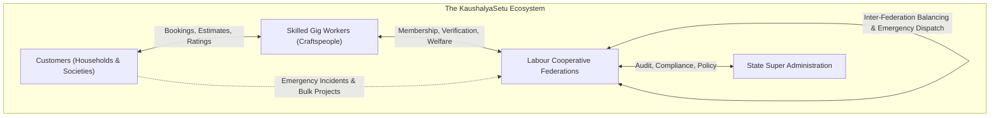

Anchoring platform governance in **Labour Cooperative Federations** ensures:
- **Fair Economics:** A modest 5% platform fee reinvested in member welfare, with a ₹200 minimum visit guarantee.
- **Institutional Protection:** Cooperative welfare fund contributions, insurance tracking, and NSDC skill certifications.
- **Mission Resilience:** Deterministic multi-worker emergency response and consent-governed inter-federation balancing.

---

## 2. Problem Statement

**Problem Statement ID:** 26089  
**Theme:** Agriculture, FoodTech & Rural Development | **Category:** Software  
**Title:** Cooperative Gig Services Platform for Household & Community Services  

### The Tripartite Challenge
- **For Gig Workers:** Fragmented jobs, lack of social security (health, pensions), arbitrary customer underpayment, and no formal upskilling pathways.
- **For Customers:** Inability to verify worker competence or institutional backing, unpredictable pricing, and difficulty coordinating multi-worker crews for repairs or crises.
- **For Cooperatives:** Manual record-keeping, regional workforce imbalances (seasonal surpluses vs. industrial shortages), and lack of real-time emergency dispatch infrastructure.

### National Sector Context *(Source presentation data)*
- **7,198,665+** registered informal gig workers across primary vocational trades in India.
- **44,859+** registered Primary Labour Cooperative Societies.
- Over **89%** of labor cooperatives currently operate offline without modern digital dispatch tools.

---

## 3. Proposed Solution

KaushalyaSetu connects **Customers**, **Workers**, **Cooperative Federations**, and **Super Administrators** into a continuous cooperative loop:

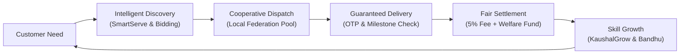

---

## 4. Six Solution Pillars

| Pillar | Strategic Focus | Implementation |
| :--- | :--- | :--- |
| **1. Verified Workforce** | Dignity and trust | Identity profiling, ITI/NSDC trade certificate vetting by federations, and verified profile badges. |
| **2. Intelligent Service Matching** | Precision dispatch | 6-tier ranking engine balancing trade skills, distance radius, weekly availability, rating, and active workload. |
| **3. Seamless Service Delivery** | Predictable execution | 16-state canonical booking lifecycle, secure 4-digit customer OTP verification, and in-app milestone tracking. |
| **4. Fair & Transparent Pricing** | Worker protection | Enforced Minimum Visit Charge (₹200), itemized labor/parts billing, capped 5% platform fee, and GST transparency. |
| **5. Cooperative Empowerment** | Collective resilience | Federation membership rosters, cooperative welfare fund ledgers, bulk project management, and grievance arbitration. |
| **6. AI-Driven Workforce Intelligence** | Adaptive guidance | SmartServe multimodal problem diagnosis, KaushalyaBandhu worker mentoring, and demand forecasting with 100% deterministic fallback. |

---

## 5. Five Primary Product Differentiators

1. **SmartServe AI:** Multimodal problem diagnosis engine accepting text descriptions and photos to classify trade categories, detect urgency, check schedule conflicts, and match verified local artisans.
2. **Emergency Workforce Response (Incident Architecture):** Decoupled from normal bookings, this incident engine executes a deterministic Response Matrix to deploy multi-trade teams with designated Team Leads for community crises.
3. **Large Project Workforce Orchestration:** Coordinates multi-worker, multi-skill teams across milestone timelines with daily site monitoring ledgers and expense auditing.
4. **Inter-Federation Workforce Balancing:** Regulated inter-district capacity sharing allowing deficit federations to mobilize surplus verified workers, governed by mandatory worker consent.
5. **KaushalyaBandhu — Worker Growth Mentor:** Comprehensive worker mentoring engine analyzing real-time job history, earnings velocity, and trade certification gaps to deliver actionable career guidance.

---

## 6. Current Implementation vs. Product Vision

| Capability / Module | Currently Implemented in Codebase | Product Vision / Future Roadmap |
| :--- | :--- | :--- |
| **SmartServe AI** | Text & image classification via Google Gemini (`@google/generative-ai`), urgency detection, and deterministic rule fallback. | Autonomous edge computer-vision damage depth analysis and automated parts ordering. |
| **Multi-Worker Bidding** | Competing worker estimates interface (`competing-estimates-view`), sorting by price, rating, distance, experience, and selection. | Dynamic reverse-auction bid throttling and automated cooperative wage floor optimization. |
| **Emergency Services** | Full Emergency Incident engine, 40+ migration tables, deterministic Response Matrix, dispatch pool, teams, and audit logging. | Telemetry integration with National Disaster Management Authority (NDMA) API and 112 dispatchers. |
| **Large Projects** | Multi-worker allocations, milestone tracking, daily site updates, expense verification, and multi-stage payment schedules. | Automated drone/satellite site progression verification and smart-contract escrow releases. |
| **Inter-Federation Balancing**| Cross-federation mobilization, tenant isolation checks, worker consent enforcement, and Super Admin dispute escalation. | Automated interstate travel allowances and automated interstate tax clearinghouse. |
| **KaushalyaBandhu** | Context-driven worker AI mentor (`/worker/kaushal-bandhu`) evaluating jobs, earnings, trade badges, and generating advice. | Real-time speech-to-speech voice assistant supporting conversational dialect guidance for low-literacy artisans. |
| **KaushalGrow** | Vocational learning module (`/worker/grow`), Super Admin LMS course publishing system, and video/PDF curricula. | Automated proctored video skill assessments and direct NSDC Skill India API certification synchronization. |
| **Demand Intelligence** | Regional service demand aggregation, trade shortage detection, and Groq-powered advisory with complete fallback engine. | Autonomous macro-economic labor migration predictive models and seasonal agricultural labor forecasting. |
| **Mobile Experience** | Mobile-first responsive web application (Next.js 14) optimized for PWA and website-to-APK Android containerization. | Native Android Studio / Capacitor codebases with background Bluetooth beacon tracking and offline SQLite sync. |
| **Payment Gateways** | Deterministic Mock/Prototype payment gateway verifying complete invoice, tax, and ledger settlement flows. | Production Razorpay webhook listeners and live banking UPI AutoPay disbursement integration. |
| **Internationalization** | Production-ready localization in English (`en`), Gujarati (`gu`), and Hindi (`hi`) via centralized dictionaries (`lib/i18n`). | Expansion to 22 scheduled Indian languages with automated neural dialect translation. |

---

## 7. Exact Four Platform Roles

The application strictly enforces **four authenticated roles**:

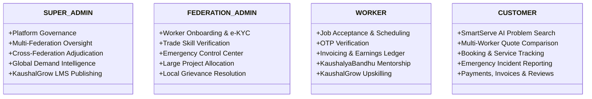

### Role Capabilities & Responsibility Matrix

| Feature / Domain | `CUSTOMER` | `WORKER` | `FEDERATION_ADMIN` | `SUPER_ADMIN` |
| :--- | :---: | :---: | :---: | :---: |
| **Primary Device Profile** | Mobile-First | Mobile-First | Desktop / Tablet | Desktop Workstation |
| **Service Discovery & Booking** | Create & Manage | Receive & Bid | Regional Oversight | Global Platform Audit |
| **Emergency Incidents** | Report & Track | Respond & Check-In | Control Center Dispatch | State Incident Audit |
| **Large Project Management** | Create Request | Assigned Tasks | Form Teams & Milestones | Inter-Fed Oversight |
| **Worker Onboarding & KYC** | — | Submit Credentials | Verify & Approve | Revoke / Blacklist |
| **Welfare & Social Fund** | — | View Passbook | Record Contributions | Platform Matching Ledger |
| **Dispute Resolution** | Submit Grievance | Submit Grievance | Investigate & Resolve | Adjudicate Escalations |
| **AI Advisory Modules** | SmartServe AI | KaushalyaBandhu | Federation AI Intelligence | Platform Demand Intel |
| **Learning Management (LMS)** | — | KaushalGrow Access | Track Member Badges | Author & Publish Courses |

---

## 8. Customer Experience

Built mobile-first for rapid service discovery, high trust, and price transparency.

### Primary Navigation
- **Home:** Quick service shortcuts, emergency reporting trigger, active service status banners, and bulk project requests.
- **Find a Worker:** Filter by trade, location, rating, and cooperative affiliation; compare candidate cards.
- **SmartServe AI:** AI-assisted multimodal problem diagnosis interface.
- **My Bookings:** Active and historical bookings with real-time status trackers and OTP codes.
- **Payments & Bills:** Itemized invoices, payment status history, and receipt downloads.
- **Profile:** Contact details, saved household addresses, and language preference selector.

### Normal Booking Flow
```text
Register/Login ➔ Select Service & Trade ➔ Describe Problem / Upload Photo ➔ View Platform Estimate (Min ₹200)
  ➔ Confirm Address & Slot ➔ System Dispatches to Local Verified Workers ➔ Review Competing Worker Estimates
  ➔ Confirm Selected Worker ➔ Track Transit ➔ Share 4-Digit OTP on Arrival ➔ Service Started
  ➔ Service Completed ➔ Review Itemized Bill ➔ Settle Payment ➔ Submit Rating & Feedback
```

---

## 9. Worker Experience

Designed specifically for artisan ease of use, high contrast, low cognitive friction, and vocational growth.

### Primary Navigation
- **Home / Dashboard:** Online/Offline availability toggle, today's schedule, new broadcast job cards, and emergency alerts.
- **My Schedule & Jobs:** Active job lifecycle manager with integrated navigation and OTP verification modals.
- **Earnings & Invoices:** Daily/weekly earnings summary, settled payouts, and generated invoice copies.
- **Welfare & Certification:** Cooperative welfare fund balance, insurance coverage status, and earned trade badges.
- **KaushalGrow:** Trade upskilling courses, safety training videos, and quiz assessments.
- **KaushalyaBandhu:** Personal AI mentor for job conversion tips, regional demand hotspots, and performance reviews.

### Worker Service Lifecycle
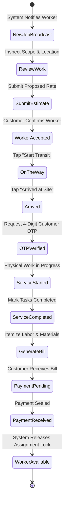

> **CRITICAL RULE:** A worker is **NOT** marked as `AVAILABLE` immediately upon `SERVICE_COMPLETED`. The worker profile remains locked until the final bill is generated, payment is settled, and the booking reaches `BOOKING_COMPLETED`.

---

## 10. Federation Administrator Experience

Federation Administrators act as regional cooperative managers overseeing member welfare, operational quality, and local crises.

### Key Capabilities
- **Member Worker Roster:** Onboard artisans, inspect ITI/NSDC trade certificates, review e-KYC documents, and approve or suspend profiles.
- **Emergency Control Center:** Real-time triage console receiving automated emergency incident feeds, monitoring dispatch pool responses, and forming emergency crews.
- **Large Project Oversight:** Allocate skilled crews to multi-week institutional contracts, inspect milestone progress photos, and approve contractor expense claims.
- **Grievance Resolution:** Investigate customer complaints regarding incomplete work or overcharging; issue binding cooperative resolutions or refunds.
- **Welfare Fund Management:** Monitor cooperative welfare reserve matching funds and record member insurance claims.

---

## 11. Super Administrator Experience

The Super Administrator operates at the state or apex union level, ensuring regulatory compliance, financial integrity, and cross-federation network balancing.

### Key Capabilities
- **Platform Analytics & Financial Auditing:** Platform GMV tracking, 5% cooperative fee retention reconciliation, and GST tax compliance reporting.
- **Inter-Federation Workforce Balancing:** Supervise cross-federation worker mobilization requests, balancing regional trade shortages against neighboring surpluses with mandatory worker consent.
- **Cross-Federation Grievance Adjudication:** Final escalation appellate court for complex disputes involving multiple cooperatives or commercial contracts.
- **KaushalGrow Curriculum Authoring:** Centrally curate, publish, and update vocational courseware, safety guidelines, and certification criteria for all trade federations.
- **System Health & Tenant Isolation:** Monitor database RLS enforcement, API throughput, error rates, and security audit logs.

---

## 12. Normal Service Booking Lifecycle

The normal service booking engine is governed by a strict, non-skippable **16-state canonical state machine** (`constants/booking-status.ts`):

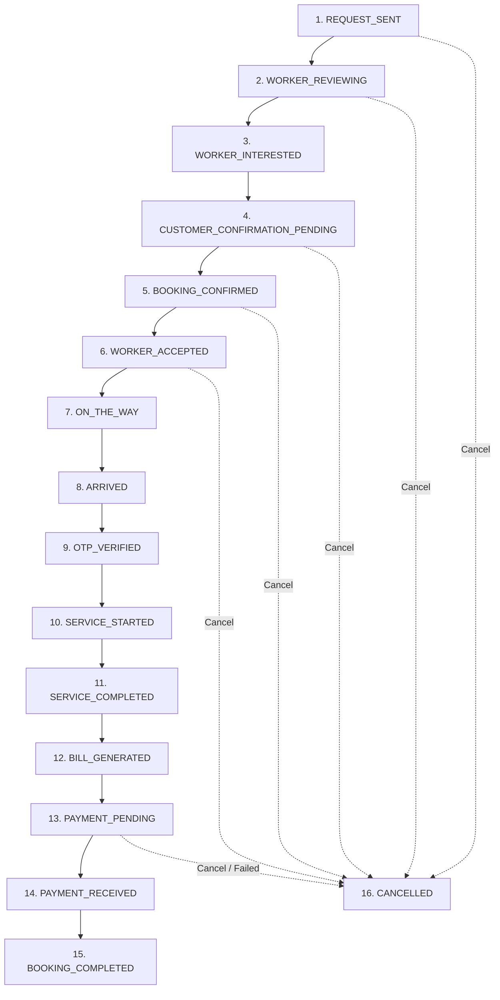

### The 16 Canonical Booking States
1. `REQUEST_SENT`: Customer submits initial job requirements.
2. `WORKER_REVIEWING`: Matching algorithm broadcasts candidate requests to verified workers.
3. `WORKER_INTERESTED`: Candidate workers submit bids or express availability.
4. `CUSTOMER_CONFIRMATION_PENDING`: Customer reviews worker profiles and estimates.
5. `BOOKING_CONFIRMED`: Customer selects preferred worker; request locked.
6. `WORKER_ACCEPTED`: Worker formally locks schedule and accepts confirmed job.
7. `ON_THE_WAY`: Worker marks transit commencement.
8. `ARRIVED`: Worker arrives at customer's verified geolocation.
9. `OTP_VERIFIED`: Secure customer 4-digit OTP verified by worker app.
10. `SERVICE_STARTED`: Active physical work commenced on site.
11. `SERVICE_COMPLETED`: Physical work completed; task checklist verified.
12. `BILL_GENERATED`: Final itemized bill submitted by worker.
13. `PAYMENT_PENDING`: Awaiting customer payment confirmation.
14. `PAYMENT_RECEIVED`: Payment successfully verified by payment gateway.
15. `BOOKING_COMPLETED`: Financials settled, worker released to pool, reviews enabled.
16. `CANCELLED`: Formal cancellation with audit justification.

---

## 13. Pricing Model & Financial Architecture

All financial calculations reside in `features/pricing/services/pricing-service.ts`.

### Financial Constants
- **Platform Fee:** `5.0%` (Reinvested in cooperative development; compares with 20–30% on private apps).
- **Minimum Service Visit Charge:** `₹200.00` (Guaranteed floor for worker compensation).
- **GST / Tax:** `18.0%` | **Currency:** Indian Rupee (`INR / ₹`)

### Mathematical Formulas

#### A. Platform Estimate
$$\text{Effective Base} = \max(\text{Base Catalog Price}, \text{Minimum Visit Charge})$$
$$\text{Platform Fee} = \text{Effective Base} \times 0.05, \quad \text{GST Tax} = \text{Platform Fee} \times 0.18$$
$$\text{Estimated Total} = \text{Effective Base} + \text{Platform Fee} + \text{GST Tax}$$

#### B. Final Bill
$$\text{Service Fee} = \max(\text{Worker Labor Charges}, \text{Minimum Visit Charge})$$
$$\text{Platform Fee} = \text{Service Fee} \times 0.05, \quad \text{GST Tax} = (\text{Service Fee} + \text{Platform Fee}) \times 0.18$$
$$\text{Net Payable} = \text{Service Fee} + \text{Parts Charges} + \text{Platform Fee} + \text{GST Tax} - \text{Discount}$$

### Payment Transaction States
- `PENDING`: Invoice issued, awaiting settlement.
- `PAID`: Transaction confirmed, funds credited to cooperative escrow.
- `FAILED`: Transaction aborted; retry cycle initiated.
- `REFUNDED`: Cooperative-authorized reimbursement upon grievance resolution.

---

## 14. SmartServe AI

SmartServe AI is KaushalyaSetu's entry point for customer service discovery, built to diagnose complex household breakdowns from text descriptions and photographs.

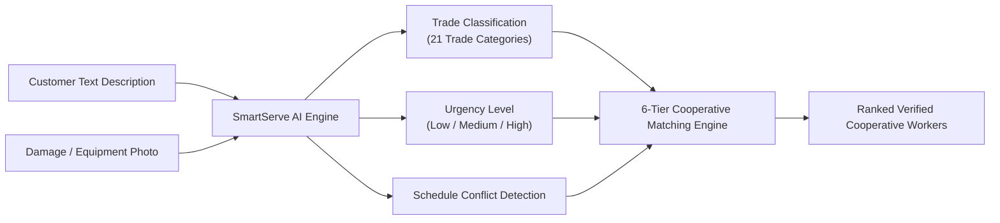

### Technical Implementation & Fallback
- **Multimodal AI Backend:** Powered by Google Gemini (`@google/generative-ai`) via `/api/analyze-service`.
- **Validation:** 5MB photo limit (`image/jpeg`, `image/png`, `image/webp`) and 1,000-character description cap.
- **Zero-Failure Architecture:** If the Google Gemini API key is unconfigured or encounters an outage, SmartServe automatically falls back to a deterministic keyword/heuristics classification engine.

---

## 15. Multi-Worker Smart Bidding (Competing Estimates)

To ensure fair market pricing without predatory wage-undercutting, KaushalyaSetu implements a **Transparent Competing Estimates Engine** (`competing-estimates-view.tsx`).

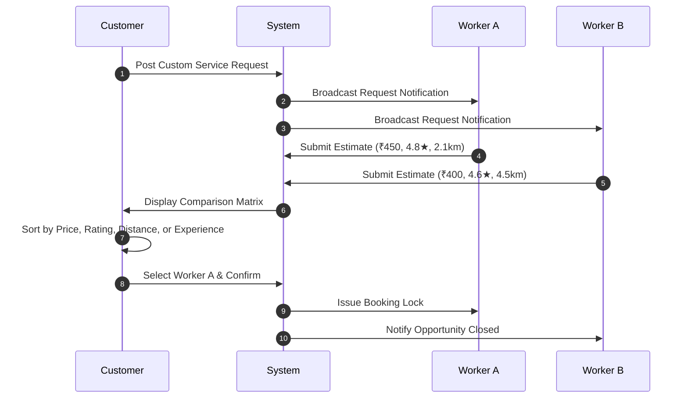

- **Transparent Quotes:** Workers submit fair estimates based on craftsmanship, distance, and scope.
- **Customer Control:** Customers review full worker credentials, cooperative affiliation, verified reviews, and proximity before locking an estimate.

---

## 16. Emergency Workforce Response (Incident Architecture)

**Emergency Service is an Emergency Incident, NOT a normal booking.**  
Normal bookings follow single-worker linear schedules. Emergency Incidents represent high-severity, multi-worker crises requiring instant team mobilization and continuous federation supervision.

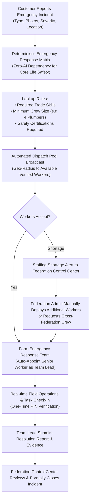

### Deterministic Emergency Response Matrix
Core safety decisions **never depend on probabilistic AI**. Pre-seeded matrices define mandatory crew configurations:

| Incident Category | Severity | Predefined Incident Type | Mandatory Crew Composition | Designated Team Lead Role |
| :--- | :---: | :--- | :--- | :--- |
| **Water Infrastructure** | `CRITICAL` | Society Water Tank Structural Burst | 4 Plumbers + 2 Masons | Senior Master Plumber |
| **Water Infrastructure** | `HIGH` | Main Water Supply Line Rupture | 2 Plumbers | Senior Plumber |
| **Electrical Systems** | `CRITICAL` | Transformer / Riser Cable Short & Sparking | 3 Industrial Electricians | Certified High-Voltage Wireman |
| **Electrical Systems** | `HIGH` | Domestic Main Breaker Panel Fire | 2 Electricians | Master Electrician |
| **Gas & Hazardous** | `CRITICAL` | Society Piped LPG Pipeline Leakage | 2 Gas Technicians + Safety Lead | Certified Gas Systems Inspector |
| **Structural / Disaster** | `CRITICAL` | Monsoon Basement Water Inundation | 3 Pump Operators + 2 Helpers | Industrial Pump Technician |

### Advanced Incident Resilience Features
- **No-Show Worker Replacement:** If an accepted worker fails to transit within 10 minutes, the dispatch engine revokes assignment and auto-broadcasts to reserve candidates.
- **One-Time Emergency PIN:** Instant 6-digit verification code enabling zero-friction site check-in.
- **Simplified Customer Tracker:** Real-time visual progress: `Emergency Active` ➔ `Response Team Assembled` ➔ `Crew In Transit` ➔ `Crew On Site` ➔ `Work in Progress` ➔ `Emergency Resolved`.
- **Immutable Audit Trail:** All severity changes, team additions, and closure notes are logged in `emergency_audit_logs`.

---

## 17. Large Project Workforce Orchestration

Large commercial and civic projects (e.g., community hall renovations, school rewiring, housing society maintenance) require multi-worker, multi-skill orchestration (`features/projects/`).

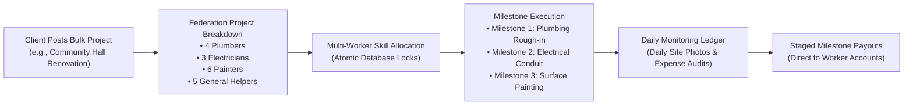

- **Daily Site Monitoring Ledger (`daily_monitoring_ledger`):** Records daily attendance, site logs, supervisor notes, and verified material purchase receipts.
- **Milestone Checkpoints:** Payments are released in escrow tranches strictly upon client and federation supervisor sign-off.
- **Fair Wage Floor:** Platform guarantees that every assigned worker receives their predetermined daily cooperative wage floor.

---

## 18. Inter-Federation Workforce Balancing

During localized demand shocks, a single cooperative federation may suffer acute labor deficits while a neighboring district holds surplus idle labor.

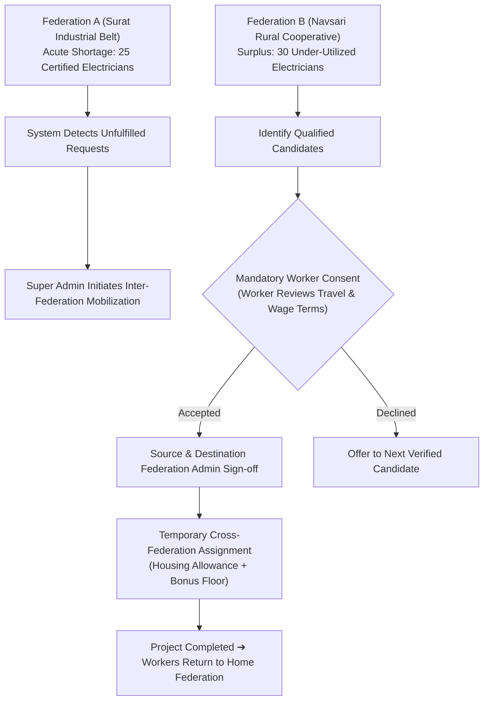

- **Mandatory Worker Consent:** Zero involuntary forced relocations. Workers receive full transparent disclosure of temporary travel, lodging provisions, and daily stipends.
- **Dispute Adjudication:** Handled directly by the Super Administrator to ensure equal pay and prevent inter-district wage dumping.

---

## 19. KaushalyaBandhu — Worker Growth & Support Mentor

**KaushalyaBandhu (कौशल बंधु / કૌશલ બંધુ)** is an intelligent worker career mentor embedded directly inside the worker dashboard (`/worker/kaushal-bandhu`).

### The 7 Core Mentorship Areas
1. **Performance Diagnostics:** Analyzes job completion velocity, customer ratings, and response punctuality.
2. **Opportunity Radar:** Identifies untapped neighborhood demand pockets for the artisan's specific trade.
3. **Regional Work Guidance:** Recommends optimal travel radii based on transit economics.
4. **Skill & Certification Recommendations:** Identifies missing trade credentials that would unlock higher wage brackets.
5. **Grievance Guidance:** Provides impartial procedural advice when a worker faces customer disputes.
6. **Welfare Awareness:** Explains available cooperative health, pension, and insurance schemes.
7. **Personalized Growth Plans:** Outlines concrete 30-day milestones for apprentice-to-master advancement.

> **GOVERNANCE RULE:** KaushalyaBandhu is an advisory mentor. It **never** adjudicates complaints or overrides federation disciplinary policies. Official grievance resolution remains the sovereign responsibility of Federation Administrators.

---

## 20. KaushalGrow — Vocational Learning Management

KaushalGrow is the integrated vocational upskilling system (`/worker/grow`), administered by Super Admins and accessible to all verified workers:

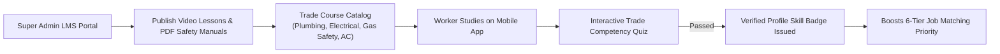

### Verified Vocational Course Tracks
- **Electrical Trades:** Advanced Inverter Wiring, Three-Phase Industrial MCB Installation, High-Voltage Safety Standards.
- **Plumbing Trades:** Modern PEX Piping Fitting, Concealed Valve Leak Detection, Commercial Drainage Unclogging.
- **HVAC & Appliances:** R32/R410A Refrigerant Recovery & Charging, Inverter AC PCB Troubleshooting.
- **Safety & Soft Skills:** Customer Etiquette, Electrical Shock First Aid, Confined Space Entry Safety.

---

## 21. Demand Intelligence & Federation AI

KaushalyaSetu aggregates platform-wide booking patterns to provide forward-looking labor intelligence to cooperative administrators:
- **SmartServe AI:** Operates at the **micro-level** (diagnosing an individual household customer's immediate breakdown).
- **KaushalyaBandhu:** Operates at the **individual worker level** (guiding an artisan's personal skills and earnings).
- **Demand Intelligence & Federation AI:** Operates at the **macro-level** (analyzing regional booking volume, detecting upcoming trade shortages, and advising federation leadership on apprenticeship intake targets).

---

## 22. Cooperative Intelligence Loop

All platform layers feed into an ongoing self-reinforcing flywheel:

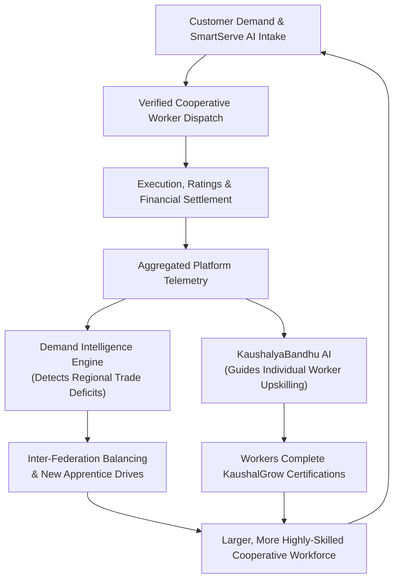

---

## 23. Welfare, Certification & Grievance Governance

### Cooperative Social Safety Net
- **Welfare Matching Fund (`welfare_records`):** A fraction of the 5% platform fee is deposited into the worker's cooperative welfare ledger, matched by state federation grants.
- **Accident & Health Insurance (`insurance_records`):** Active workers maintaining minimum monthly availability receive cooperative-backed group accidental injury and hospitalization coverage.
- **Standardized Certifications (`worker_certifications`):** Formal integration with NSDC (National Skill Development Corporation) and State Technical Education Board curricula.

### Grievance Governance Lifecycle
```text
Customer / Worker Submits Complaint + Evidence Photos ➔ Assigned to Regional Federation Admin Console
  ➔ Investigation: Review Chat Logs, Geolocation, Photos & Bill ➔ Resolution: Dismiss, Refund, Rework, or Penalty
  ➔ Unresolved Disputes Escalated to Super Administrator for Final Adjudication
```

---

## 24. Multilingual Accessibility

To support artisans and customers across diverse regional backgrounds, KaushalyaSetu provides built-in internationalization across all user touchpoints.

### Currently Implemented Languages (`lib/i18n`)
- **English (`en`):** Full technical and customer interface.
- **Hindi (`hi` — हिन्दी):** Complete vernacular translations for worker onboarding, job cards, OTP modals, and guidance.
- **Gujarati (`gu` — ગુજરાતી):** Full vernacular support tailored for regional cooperative federations and artisans.

---

## 25. Mobile Experience & Android Deployment

### Architecture
KaushalyaSetu is architected as an ultra-responsive, mobile-first web application powered by **Next.js 14**, optimized for low-latency performance on 4G Android smartphones.

```text
Next.js 14 Progressive Web Application (PWA)
  │
  ▼
Website-to-APK Containerization Pipeline
  │
  ▼
Standalone Android APK Package for Direct Sideloading & Worker Distribution
```

> **HONEST IMPLEMENTATION DISCLOSURE:** The application is packaged for Android devices using web-to-APK containerization. While future product extensions envision dedicated Capacitor and native Android Studio integration, the current production build runs cleanly via modern mobile web browsers and containerized APK runtimes.

---

## 26. Technical Architecture

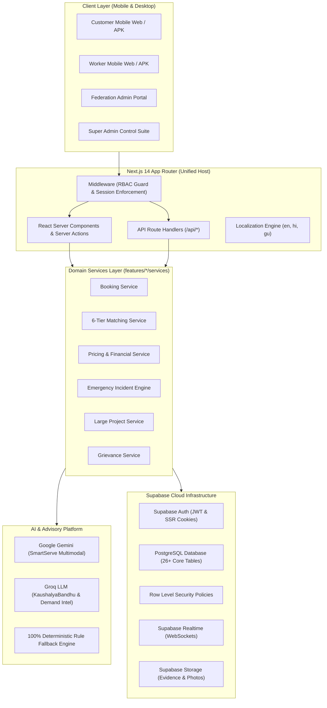

---

## 27. Technology Stack Breakdown

| Layer | Technology | Current Usage Status |
| :--- | :--- | :--- |
| **Framework** | Next.js 14 (App Router) | Core Application Framework (SSR, RSC, Server Actions) |
| **Language** | TypeScript 5.4 | Strict type-safety across all domain models and API contracts |
| **Styling** | Tailwind CSS 3.4 & shadcn/ui | Full design system with responsive tokens and high contrast |
| **Icons** | Lucide React | High-legibility trade and navigation icons |
| **State Management** | Zustand & React Hook Form | Mobile wizard workflows, forms, and local state caches |
| **Validation** | Zod 3.23 | Schema validation for all API inputs and booking payloads |
| **Database** | PostgreSQL via Supabase | Relational data persistence with foreign key integrity |
| **Authentication** | Supabase Auth | Session cookies, JWT validation, and RBAC middleware |
| **Realtime** | Supabase Realtime | WebSocket feeds for emergency incidents and worker dispatch |
| **Storage** | Supabase Storage | Encrypted storage buckets for incident and complaint photos |
| **Multimodal AI** | Google Gemini (`@google/generative-ai`) | SmartServe AI text and photograph problem diagnosis |
| **Advisory AI** | Groq API (`openai/gpt-oss-20b`) | KaushalyaBandhu worker mentoring and demand forecasting |
| **Fallback Engine** | Custom TypeScript Rule Engine | 100% offline deterministic fallback if external AI APIs fail |
| **Mobile Deployment**| Responsive Web / APK Packaging | Mobile-first web app containerized to installable Android APK |
| **Payments** | Prototype Mock Payment Engine | Fully verifies complete billing, tax, and ledger workflows |

---

## 28. Authentication, Authorization & RBAC

Security is implemented using a **defense-in-depth model** combining HTTP middleware session inspection with PostgreSQL Row Level Security (RLS).

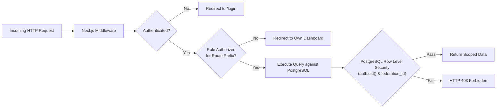

### Route Guard Enforcement (`middleware.ts`)
- `/super-admin/*` ➔ Restricted strictly to `SUPER_ADMIN`.
- `/federation-admin/*` ➔ Restricted to `FEDERATION_ADMIN` and `SUPER_ADMIN`.
- `/worker/*` ➔ Restricted to `WORKER` and `SUPER_ADMIN`.
- `/customer/*` ➔ Restricted to `CUSTOMER` and `SUPER_ADMIN`.
- Cross-role tampering is automatically blocked and redirected to the user's sovereign dashboard.

---

## 29. Realtime Architecture

KaushalyaSetu uses **Supabase Realtime WebSockets** to maintain synchronized state across distributed mobile devices and administrative control rooms:
1. **Emergency Control Center (`emergency_incidents`):** Federation Admins observe incoming incidents in real time without refreshing.
2. **Worker Dispatch Pool (`emergency_dispatch_pool`):** Mobile workers receive instant broadcast popups when emergency calls are triggered in their radius.
3. **Emergency Field Check-In (`emergency_verification_codes`):** Live check-in timestamps stream to the customer's tracking screen as technicians arrive.
4. **Multi-Worker Bidding Updates (`worker_estimates`):** Customers observe competing worker quotes appearing live on their comparison board.

---

## 30. Database Architecture & Schema

The database schema is organized into modular relational domains across 26+ core tables:
- **Identity & Access:** `profiles`, `federations`, `addresses`, `notifications`.
- **Workforce & Skills:** `workers`, `service_categories`, `services`, `skills`, `worker_skills`, `certifications`, `worker_certifications`, `worker_availability`.
- **Bookings & Financials:** `bookings`, `booking_status_history`, `job_requests`, `worker_estimates`, `invoices`, `invoice_items`, `payments`, `reviews`.
- **Emergency Incidents:** `emergency_incidents`, `emergency_response_matrix`, `emergency_dispatch_pool`, `emergency_response_teams`, `emergency_response_team_members`, `emergency_incident_tasks`, `emergency_additional_worker_requests`, `emergency_verification_codes`, `emergency_audit_logs`.
- **Large Projects:** `project_requests`, `project_requirements`, `project_allocations`, `daily_monitoring_ledger`.
- **Welfare & Grievances:** `welfare_records`, `insurance_records`, `complaints`.

---

## 31. API Architecture

All endpoints are built as Next.js App Router Route Handlers (`app/api/*`) utilizing strict Zod payload validation:

| API Domain | Route Endpoint | Method | Role Access | Description |
| :--- | :--- | :---: | :--- | :--- |
| **Auth** | `/api/auth/me` | `GET` | Authenticated | Retrieve session profile and role |
| **SmartServe** | `/api/analyze-service` | `POST` | `CUSTOMER` | Multimodal text/photo service classification |
| **Bookings** | `/api/bookings` | `GET, POST` | `CUSTOMER, WORKER` | Query and create canonical bookings |
| **Bookings** | `/api/bookings/[id]/status`| `PATCH`| Authorized Actor | Transition canonical booking state |
| **Worker Jobs**| `/api/worker/jobs` | `GET` | `WORKER` | Retrieve assigned and broadcast jobs |
| **Worker AI** | `/api/worker/kaushal-bandhu`|`POST` | `WORKER` | Generate personalized mentoring advice |
| **Projects** | `/api/projects` | `GET, POST` | `CUSTOMER, FED_ADMIN` | Manage large commercial projects |
| **Projects** | `/api/projects/progress` | `POST` | `FED_ADMIN` | Log milestone progress and approvals |
| **Emergency** | `/api/emergency/incidents` | `POST` | `CUSTOMER, FED_ADMIN` | Report new emergency incident |
| **Emergency** | `/api/emergency/matrix` | `GET` | All Roles | Fetch predefined response rules |
| **Emergency** | `/api/emergency/dispatch/[id]/respond`|`POST`|`WORKER`| Accept/decline emergency dispatch |
| **Emergency** | `/api/emergency/check-in` | `POST` | `WORKER` | Verify field PIN and mark arrived |
| **Emergency** | `/api/emergency/incidents/[id]/resolve`|`POST`|`WORKER, FED_ADMIN`| Submit resolution evidence & close |
| **Grievance** | `/api/complaints` | `GET, POST` | All Roles | Lodge and review dispute records |

---

## 32. Repository Structure

```text
├── app/                        # Next.js 14 App Router routes & layouts
│   ├── (auth)/                 # Login, registration, & role routing
│   ├── (dashboard)/            # Sovereign role portals (customer, worker, fed-admin, super-admin)
│   ├── api/                    # 30+ RESTful API route handlers
│   └── globals.css             # Design tokens & color variables
├── components/                 # UI primitives, layout shells, & SmartServe cards
├── config/                     # Navigation, permissions, & pricing parameters
├── constants/                  # Single source of truth for booking/payment states
├── features/                   # 21 domain business modules (bookings, emergency, matching, pricing, etc.)
├── lib/                        # AI providers, emergency stores, i18n dictionaries, Supabase clients
├── public/                     # Static assets, logos (kaushalyasetu-logo.png), & imagery
├── scripts/                    # 150+ verification suites, diagnostic tools, & seed scripts
├── supabase/                   # Database migrations, RLS policies, & SQL seeds
└── types/                      # Canonical TypeScript domain interfaces
```

---

## 33. Feasibility & Viability Analysis

### 1. Technical Feasibility
Built on standardized open-source foundations (Next.js 14, TypeScript, PostgreSQL) without vendor lock-in. AI integrations serve in an advisory capacity; if external APIs disconnect, 100% of platform booking and emergency workflows execute cleanly via deterministic fallback engines.

### 2. Operational Feasibility
Operates within established cooperative hierarchies, equipping Federation Admins with modern digital tools to verify members, automate dues, and secure civic tenders without disrupting union governance.

### 3. Economic Feasibility
The self-sustaining 5% platform fee replaces predatory 25% commercial margins, covering cloud infrastructure, member accident insurance, and cooperative reserves.

### 4. Scalability Architecture
Multi-tenant federation scoping enables horizontal scaling from single municipal cooperatives to state-level federations via PostgreSQL partitioning and scoped indexing.

---

## 34. Risk Assessment & Mitigation Matrix

| Risk Category | Identified Hazard | Engineering & Operational Mitigation |
| :--- | :--- | :--- |
| **Worker Verification** | Fraudulent trade claims or counterfeit identity cards. | Mandatory federation review of physical ITI/NSDC trade certificates; verified badge assignment; customer OTP sign-off. |
| **Data & Privacy** | Unauthorized access to customer home addresses or phone numbers. | Defense-in-depth security: Next.js middleware route protection + PostgreSQL Row Level Security (RLS) restricting address visibility strictly to assigned workers. |
| **Workforce Coordination** | No-shows during critical emergency incidents. | Automated 10-minute dispatch timeout rules; automated reserve worker deployment; escalation to Federation Control Center. |
| **Trust & Adoption** | Resistance to digital platforms among low-literacy artisans. | Trilingual vernacular UI (Hindi, Gujarati); high-contrast color codes; voice-friendly icon designs; KaushalyaBandhu guidance. |

---

## 35. Academic Research & References

1. **Cook, C., & Rani, U. (2024).** *Cooperative Platforms as Alternatives to Algorithmic Management: Worker Autonomy and Fair Wages in Developing Economies.* Journal of Labor Economics & Policy.
2. **Ghatak, M. (2025).** *Decentralized Collective Bargaining in the Urban Informal Service Sector.* Annual Review of Economics.
3. **Malhotra, R., & Agrawal, S. (2025).** *Digital Transformation of Primary Labour Cooperatives in South Asia.* International Co-operative Alliance Research Monograph.
4. **Faras, N., Mehta, K., & Datta, S. (2025).** *Designing Resilient Municipal Gig Response Systems for Extreme Urban Weather Events.* Sustainable Cities and Society.
5. **Pankaj, A., & Jha, R. (2026).** *Social Protection Architecture for Informal Craftspeople: Transitioning from Subsistence Gig Work to Certified Trades.* Development Policy Review.
6. **NITI Aayog. (2022).** *Booming Gig and Platform Economy: Perspectives and Recommendations on the Future of Work.* Government of India.
7. **International Labour Organization (ILO). (2024).** *World Employment and Social Outlook: The Role of Cooperatives in Promoting Decent Work.* Geneva.
8. **ILO & Institute for Human Development (IHD). (2024).** *India Employment Report 2024: Youth, Skills, and the Informal Economy.* New Delhi.
9. **ILO, OECD & ISSA. (2023).** *Social Protection for Platform Workers: International Best Practices and Policy Frameworks.*
10. **Ministry of Labour & Employment, Government of India.** *e-Shram National Database for Unorganized Workers: Strategic Integration Guidelines.*

---

## 36. Installation & Setup

### Prerequisites
- **Node.js:** `v18.18.0` or `v20.x` LTS | **Package Manager:** `npm` (v9+)
- **Database:** Supabase Cloud instance or local Supabase Docker CLI

### Setup Steps
```bash
# 1. Clone repository
git clone https://github.com/KavyaVaghela/SIH_2026_Main.git
cd SIH_2026_Main

# 2. Install dependencies
npm install

# 3. Configure environment
cp .env.example .env.local

# 4. Start local development server
npm run dev

# 5. Build for production verification
npm run build
```

---

## 37. Environment Variables

Configure the following variables in `.env.local` (Reference: `.env.example`). **Never commit private secret keys to version control.**

```env
# SUPABASE
NEXT_PUBLIC_SUPABASE_URL=https://your-project.supabase.co
NEXT_PUBLIC_SUPABASE_PUBLISHABLE_KEY=your-publishable-anon-key

# SERVER-ONLY
SUPABASE_SECRET_KEY=your-supabase-service-role-key

# GOOGLE MAPS (CLIENT)
NEXT_PUBLIC_GOOGLE_MAPS_API_KEY=your-google-maps-api-key

# PAYMENT GATEWAY (FUTURE PRODUCTION INTEGRATION)
RAZORPAY_KEY_ID=your-razorpay-key-id
RAZORPAY_KEY_SECRET=your-razorpay-key-secret

# AI ADVISORY SERVICES (SERVER-ONLY)
GEMINI_API_KEY=your-google-gemini-api-key
GROQ_API_KEY=your-groq-api-key
```

---

## 38. Database Setup & Migrations

All relational tables, triggers, and Row Level Security policies are managed via timestamped SQL migrations in `supabase/migrations/`:
1. `00001_initial_schema.sql` (Core tables and spatial indexes)
2. `00002_triggers_and_functions.sql` (Auth triggers and state helpers)
3. `20260903003000_rls_policies.sql` (Row Level Security policies)
4. `emergency_services_complete_migration.sql` (Complete Emergency Services Incident Foundation)
5. `20260918000000_large_project_foundation.sql` (Commercial projects & daily monitoring ledger)

---

## 39. Verification & Automated Test Suites

The repository contains extensive diagnostic and verification scripts in `scripts/`:

```bash
# Verify Complete Emergency Incident Lifecycle
npx tsx scripts/verify_emergency_final.ts

# Verify Emergency Control Center & Dispatch Pool
npx tsx scripts/verify_emergency_control_center.ts
npx tsx scripts/verify_emergency_dispatch.ts

# Verify KaushalyaBandhu AI Mentoring Engine
npx tsx scripts/verify_kaushal_bandhu.ts

# Verify Trilingual Localization & Currency Systems
npx tsx scripts/verify_global_language_system.ts

# Verify Financial Billing & Ledger Integrity
npx tsx scripts/verify_fake_payment.ts

# Run Codebase Linter
npm run lint
```

---

## 40. Deployment Architecture

```text
GitHub Repository (main branch)
  │
  ▼
Vercel Continuous Integration & Edge Deployment
  ├── Edge Middleware (Session Validation & RBAC)
  ├── Serverless Functions (API Route Handlers)
  └── Static Asset CDN (Public Imagery & Icons)
        │
        ▼ Connected to
Supabase Cloud Infrastructure (ap-south-1 / Mumbai Region)
  ├── Managed PostgreSQL 15 Engine
  ├── Supabase Auth JWT Service
  ├── Realtime WebSocket Cluster
  └── Encrypted S3-Compatible Object Storage
```

---

## 41. Interactive Demo Journeys

### Journey A: The Household Customer
1. Navigate to `/customer` ➔ Tap **SmartServe AI**.
2. Type: *"Water pipe burst under kitchen sink, flooding floor"* and upload a pipe photo.
3. Observe instant classification: Trade **Plumbing**, Urgency **High**, Platform Estimate `₹450`.
4. Review competing estimates from verified cooperative plumbers; confirm preferred artisan.
5. Track transit, share 4-digit OTP upon arrival, review itemized final bill, and confirm payment.

### Journey B: The Emergency Incident
1. From Customer Home, tap **Report Emergency Incident**.
2. Select **Water Infrastructure** ➔ **Society Water Tank Burst** (`CRITICAL`).
3. Switch to Federation Admin (`/federation-admin/emergency`).
4. Watch incident trigger instant dispatch pool broadcast for **4 Plumbers + 2 Masons**.
5. Observe automated team formation, designated Team Lead, and live task check-in.

### Journey C: The Cooperative Worker
1. Log in as Worker (`/worker`) ➔ Toggle availability to **Online**.
2. Accept incoming job broadcast ➔ Tap **On the Way** ➔ Tap **Arrived**.
3. Enter Customer OTP to unlock **Service Started**.
4. Mark work done, submit parts cost (e.g. `₹150`), and generate final invoice.
5. Visit **KaushalyaBandhu** (`/worker/kaushal-bandhu`) to receive tailored trade advice.

### Journey D: The Federation Administrator
1. Navigate to `/federation-admin`.
2. Inspect worker onboarding queue; verify ITI trade certificate.
3. Supervise active community projects and review grievance disputes.

---

## 42. Current Limitations

- **Payment Gateway:** Runs a verified **Prototype Mock Payment Engine**. Live production Razorpay webhook listeners require commercial merchant KYC activation.
- **Maps & Navigation:** Geographic distance calculations use mathematical Haversine formulas. Live GPS road routing relies on client-side mapping rather than paid proprietary route matrix APIs.
- **Android Experience:** Mobile Android distribution is powered by optimized mobile-first web containerization (APK) rather than a separate native Java/Kotlin codebase.
- **AI Dependencies:** Conversational speech-to-speech for low-literacy workers is an active roadmap item; current advisory interfaces use high-legibility vernacular text and structured cards.

---

## 43. Future Scope

- **Voice-First Conversational Interface:** Direct speech-to-speech interface in local rural dialects for illiterate artisans.
- **Direct e-Shram & Skill India API Integration:** Real-time government database synchronization for instant worker accreditation.
- **Decentralized Cooperative Escrow:** Smart contract-based milestone releases for interstate public works tenders.
- **Autonomous Tool & Equipment Sharing Pool:** Equipment rental ledger enabling cooperative members to share expensive diagnostic tools.

---

## 44. SIH 2026 Evaluation Highlights

| Evaluation Dimension | How KaushalyaSetu Solves Problem Statement 26089 |
| :--- | :--- |
| **Theme Alignment** | Anchored in **Rural & Cooperative Development**, empowering traditional labor federations with enterprise digital tech. |
| **Institutional Dignity** | Eliminates algorithmic worker deactivation; institutionalizes cooperative welfare, insurance, and skill certifications. |
| **Engineering Rigor** | Built on a 16-state canonical booking machine, deterministic emergency matrices, and comprehensive RLS defense-in-depth. |
| **Fail-Safe Reliability** | Zero operational downtime if external AI APIs disconnect; 100% deterministic local rule fallback engines. |
| **Cooperative Primacy** | 5% transparent platform fee model reinvested into worker social safety nets rather than private venture extraction. |

---

<div align="center">

**Smart India Hackathon 2026 • Team KAUSHALYA (S0035)**  
*Building the digital bridge for India's skilled cooperative workforce.*

</div>
